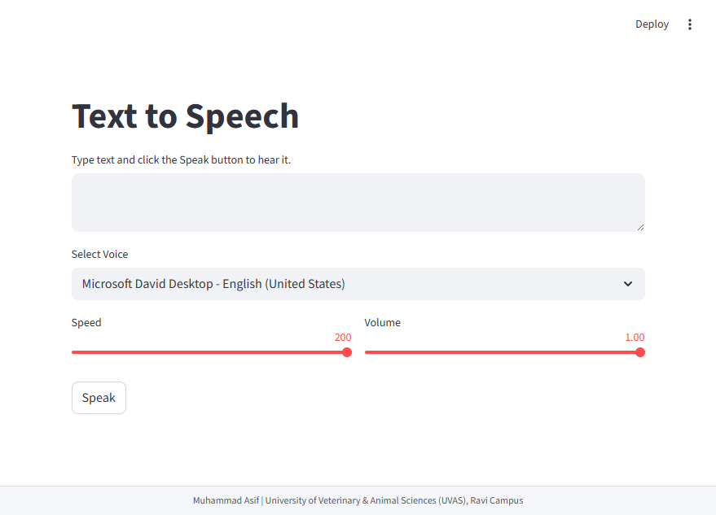

# 🗣️ Text-to-Speech & Translator App


[](https://text-to-speech-v1.streamlit.app/)

A **cross-platform Text-to-Speech (TTS) web application** built with **Python** and **Streamlit**, featuring:
- Voice selection (male/female)
- Adjustable speed & volume
- Modern, interactive UI with mic button, sliders, sidebar, and footer

---

## 🎬 Demo



---

## 🌟 Features

- **Text-to-Speech (TTS):** Converts typed text into natural speech.
- **Voice Selection:** Choose from all available system voices (male/female).
- **Adjustable Speed & Volume:** Control the speech rate and volume.
- **Modern UI:** Mic-style Speak button with hover, side-by-side sliders, sidebar with links, and footer.
- **Cross-Platform:** Works on Windows, macOS, Linux, and Streamlit Cloud.

---

## 🛠️ Installation

1. Clone the repository:

```bash
git clone https://github.com/muhammad-asif10/text_to_speech_app.git
cd text_to_speech_app
````

2. Create a virtual environment (optional but recommended):

```bash
python -m venv venv
# Activate
# Windows
venv\Scripts\activate
# Linux/macOS
source venv/bin/activate
```

3. Install dependencies:

```bash
pip install -r requirements.txt
```

---

## 🚀 Usage

Run the app:

```bash
streamlit run app.py
```

1. Type text in the **text area**.
2. Select a **voice** from the dropdown.
3. Adjust **speed** and **volume** sliders.
4. Toggle **Translator Mode** to translate text into Urdu.
5. Click the **🎙️ Speak button** to hear the speech.

---

## 📦 Dependencies

* [streamlit](https://pypi.org/project/streamlit/)
* [pyttsx3](https://pypi.org/project/pyttsx3/)
## ⚙️ Supported Platforms

* **Windows:** Uses SAPI voices by default
* **macOS / Linux:** Works with system TTS engines (`pyttsx3`)
* **Streamlit Cloud:** Fully deployable

---
## 👨‍💻 Developer

**Muhammad Asif**
* University of Veterinary & Animal Sciences (UVAS), Ravi Campus
---

## 📜 License

This project is licensed under the **MIT License** – see the [LICENSE](LICENSE) file for details.

---


